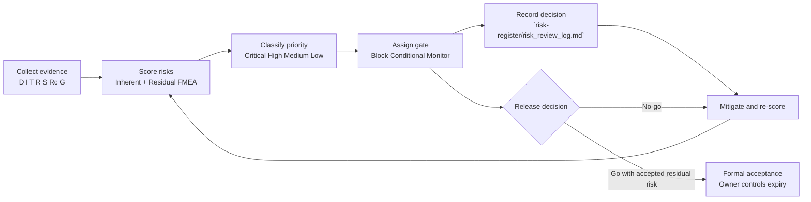
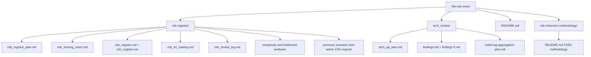

# The Risk Onion

The Risk Onion is a documentation-first risk governance baseline for software delivery and release readiness. 🧅

The core idea is simple: risk is layered across architecture, implementation, operations, and planning. This repo makes those layers explicit, measurable, and reviewable before release decisions are made.

## What this repository does

This repository combines:

- FMEA-style risk scoring (inherent and residual)
- Hard release gates with explicit acceptance authority
- Evidence confidence and freshness rules
- KRI (Key Risk Indicator) monitoring
- Forecast governance controls (reference class, percentile ranges, and tail-risk checks)
- Architecture/QA review artifacts that feed into risk treatment planning

## Methodology (FSSD)

This repository is guided by Feedback-Stabilized Software Development (FSSD), which treats software delivery as a delayed feedback-control system rather than a linear process.

- Model delivery as interacting loops: learning, error, planning, and perception
- Minimize feedback latency across development, testing, and deployment
- Separate objective evidence from perception noise to improve decisions
- Avoid late-stage structural shifts (team scaling spikes and major architecture pivots)
- Use bounded, delay-aware interventions to reduce overshoot and schedule oscillation

Read the full methodology: [`risk-reduction-methodology/README.md`](risk-reduction-methodology/README.md)

## Baseline snapshot (as of 2026-03-24) 📌

From `risk-register/risk_register.md` and `risk-register/risk_register_baseline_summary.csv`:

- Total risks: 44
- Critical: 19
- High: 13
- Medium: 12
- Low: 0
- Current release blockers (`Block`): 19

This baseline is intentionally strict: unresolved critical and high-consequence risks remain release-significant until mitigated or formally accepted with expiry-bounded controls.

## Governance flow

## Repository map

## Contents by path

| Path | Purpose |
|---|---|
| `risk-register/risk_register_plan.md` | Governance operating model, hard gate policy, ownership model, and execution phases |
| `risk-register/risk_scoring_rubric.md` | Severity/Occurrence/Detection scoring definitions, priority tiers, and acceptance rules |
| `risk-register/risk_register.md` | Primary human-readable risk register baseline (current: 44 risks) |
| `risk-register/risk_register.csv` | Machine-readable export of the full risk register |
| `risk-register/risk_kri_catalog.md` | KRI formulas, thresholds, cadence, ownership, and linked risks |
| `risk-register/risk_review_log.md` | Decision log, formal acceptance register, and cadence checklist |
| `risk-register/risk_register_baseline_summary.csv` | Snapshot metrics for current baseline |
| `risk-register/risk_register_scenarios.csv` | Crown-jewel failure-chain scenario view |
| `risk-register/risk_register_next_actions.csv` | Prioritized next governance actions |
| `risk-register/complexity_analysis_exec_summary.md` | Executive summary of complexity/churn risk and hotspots |
| `risk-register/complexity_analysis.md` | Full complexity/churn analysis, phased reduction plan, and regression strategy |
| `risk-register/bottleneck_risk_calculator.md` | Throughput and bottleneck risk model (capacity, PR load, overlap, review pressure) |
| `risk-register/scc.txt` | Language/complexity snapshot used in complexity analysis |
| `risk-register/churn.txt` | Historical file-touch data used in churn analysis |
| `risk-register/issues.json` | Static-analysis issue export used for governance context |
| `risk-reduction-methodology/README.md` | Feedback-Stabilized Software Development (FSSD) control-loop methodology |
| `arch_review/arch_qa_plan.md` | 30/60/90 architecture + QA plan with test and risk matrix |
| `arch_review/findings.md` | Repository architecture and operational concern notes |
| `arch_review/findings-2.md` | Step Functions workflow findings and serverless risk observations |
| `arch_review/initial-log-aggregation-plan.md` | Phased observability/log-aggregation strategy for Step Functions + Lambda |

## Recommended reading order

1. `risk-reduction-methodology/README.md`
2. `risk-register/risk_register_plan.md`
3. `risk-register/risk_scoring_rubric.md`
4. `risk-register/risk_register.md`
5. `risk-register/risk_kri_catalog.md`
6. `risk-register/risk_review_log.md`
7. `risk-register/complexity_analysis_exec_summary.md`
8. `risk-register/complexity_analysis.md`
9. `risk-register/bottleneck_risk_calculator.md`
10. `arch_review/arch_qa_plan.md`
11. `arch_review/findings-2.md`
12. `arch_review/initial-log-aggregation-plan.md`

## Core governance principles

- No unowned mission-critical risk
- No expired or undocumented acceptance
- No closure of `Critical`/`High` risk with document-only evidence
- No release-significant estimate without outside-view/reference-class support
- No average-only forecast reporting when tail risk can threaten outcomes

## Operating cadence

### Pre-release hardening mode

- Daily review of all `Block` and `Conditional` risks
- Daily KRI breach review
- Daily acceptance-expiry verification
- Daily forecast-bias and tail-risk review (`KRI-031` to `KRI-033`)

### BAU mode

- Weekly: `Critical` and `High` risks
- Biweekly: `Medium` risks
- Monthly: full reprioritization and trend review
- Quarterly: rubric and control-effectiveness calibration

## Maintenance workflow

1. Update risk statements in `risk-register/risk_register.md` and `risk-register/risk_register.csv`.
2. Re-score risks using `risk-register/risk_scoring_rubric.md`.
3. Update KRIs and thresholds in `risk-register/risk_kri_catalog.md` when controls change.
4. Record score/gate/acceptance decisions in `risk-register/risk_review_log.md`.
5. Refresh scenario and summary exports in:
   - `risk-register/risk_register_baseline_summary.csv`
   - `risk-register/risk_register_scenarios.csv`
   - `risk-register/risk_register_next_actions.csv`

## Who this is for

- Delivery leadership and risk boards
- Engineering, QA, Security, Operations, and Data Governance leads
- Program governance stakeholders
- Teams accountable for release readiness decisions

## Notes

- This repository currently does not include a `LICENSE` file.
- Dates in key artifacts are current through 2026-03-24 (`risk-register/risk_register.md`, `risk-register/risk_kri_catalog.md`).

If you are new here, start with the methodology, then the plan and rubric, and then move to the live register and KRI catalog. You will get to decision-grade context fastest that way. ✅
