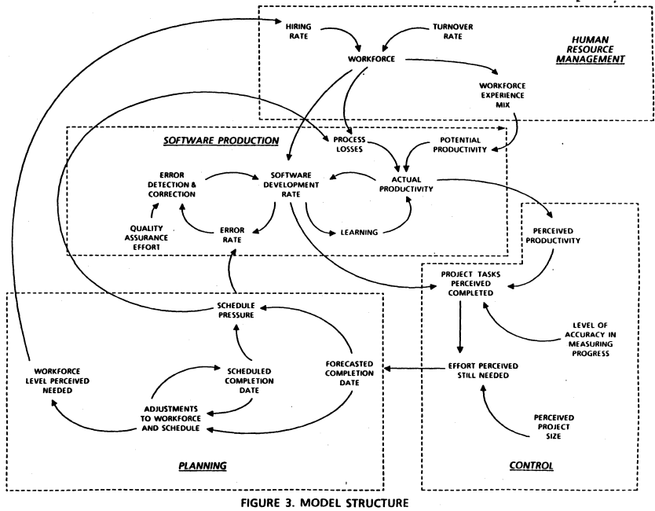

# **Methodology: Feedback-Stabilized Software Development (FSSD)**

Think of it less like a process and more like a **control system design**.

---

# Background
## Comprehensive SDLC

- https://www.researchgate.net/publication/37993566_Lessons_learned_from_modeling_the_dynamics_of_software_development
- pdf included here 

What you’ve got here is a classic **system dynamics model** of software development—very much in the Jay Forrester / Barry Boehm / Abdel-Hamid & Madnick lineage. It’s not just a diagram; it’s a **causal loop model** showing feedback structures that produce nonlinear behavior.

Here’s how to read it at a deeper level.

---

# 1. It’s not a flowchart — it’s a feedback system

Every arrow is a **causal link**, and many of them close into **feedback loops**:

* **Reinforcing loops (positive feedback)** → amplify behavior
* **Balancing loops (negative feedback)** → stabilize or regulate

This is why software projects feel chaotic:
you’re looking at a **tightly coupled, delayed-feedback system**.

---

# 2. The core engine: productivity vs errors

At the center:

* **Software development rate**
* **Error rate**
* **Error detection & correction**
* **Quality assurance effort**

This forms a fundamental loop:

### Loop A (balancing)

* More development → more errors
* More errors → more QA effort
* More QA → more error correction
* → reduces effective progress

👉 This is the classic *“fixing slows you down”* loop.

---

# 3. The hidden nonlinear driver: learning

You’ve got:

* **Learning → actual productivity**

This is crucial.

### Loop B (reinforcing)

* More development → more learning
* More learning → higher productivity
* Higher productivity → more development

👉 Early conditions here matter enormously:

* experienced team → fast takeoff
* inexperienced team → slow, error-heavy ramp

---

# 4. Workforce dynamics = delayed, destabilizing feedback

Top section:

* Hiring rate
* Turnover rate
* Workforce experience mix

This creates a dangerous loop:

### Loop C (reinforcing with delay)

* Schedule pressure → hire more people
* Hiring → lowers average experience
* Lower experience → lower productivity
* Lower productivity → more schedule pressure

👉 This is basically **Brooks’s Law embedded in dynamics**:

> “Adding manpower to a late software project makes it later.”

---

# 5. Planning loop = perception vs reality mismatch

Bottom-left:

* Scheduled completion date
* Forecasted completion date
* Adjustments to workforce & schedule
* Schedule pressure

### Loop D (balancing but lagged)

* Slipping schedule → increases pressure
* Pressure → triggers adjustments
* Adjustments → aim to correct schedule

👉 But because of delays, this often **overshoots** and oscillates.

---

# 6. Control loop = perception distortion

Right side:

* Perceived productivity
* Perceived project size
* Effort perceived still needed
* Accuracy of measuring progress

### Loop E (distorted feedback)

* Poor measurement → wrong perception
* Wrong perception → bad decisions
* Bad decisions → worse actual state

👉 This is huge in real life:
Teams aren’t reacting to reality—they’re reacting to a **noisy, biased signal**.

---

# 7. The most important insight: delays everywhere

Almost every connection here has **implicit delay**:

* Hiring → takes time to become productive
* Learning → gradual
* Error detection → delayed
* Progress measurement → lagging

👉 Delays + feedback = **oscillation, overshoot, chaos**

---

# 8. Mapping this to your “initial conditions” idea

This diagram shows something subtle:

Initial conditions don’t just set values—they set:

### 1. Loop strengths

* Strong QA vs weak QA changes loop dominance
* Strong learning vs weak learning changes trajectory

### 2. Delay lengths

* Fast feedback (CI/CD) vs slow feedback radically changes stability

### 3. Starting position in state space

* Experienced team vs novice team
* Clean codebase vs legacy mess

---

# 9. What I *specifically* see (the punchline)

This system is dominated by a **tension between three forces**:

### 1. Production (go faster)

### 2. Correction (fix errors)

### 3. Coordination (people + planning)

And the failure mode is:

> **You try to fix schedule pressure by adding people,
> which reduces productivity, increases errors,
> distorts perception, and makes the system oscillate.**

---

# 10. Why this is a nonlinear system

Because:

* Small changes in:

  * hiring timing
  * experience mix
  * measurement accuracy
* can flip which loop dominates

That’s classic nonlinear behavior:

* stable → oscillatory → chaotic regimes

---

# If I compress the whole diagram into one sentence:

> Software development is a delayed-feedback system where attempts to control schedule pressure (via staffing and planning) interact with error generation and learning dynamics, often producing counterintuitive and unstable outcomes.

---

# The Method

---

# 0. Core Principles (derived from the model)

1. **Minimize feedback latency**
2. **Separate signal from perception noise**
3. **Avoid late-stage structural changes (team, architecture)**
4. **Invest early in learning loops**
5. **Treat staffing as a slow variable, not a control knob**
6. **Continuously calibrate reality vs perception**

---

# 1. Customer Engagement (controlling input signal quality)

### Goal:

Prevent garbage-in → chaos-out

### Method:

**1.1 Continuous Discovery Loop**

* Weekly structured stakeholder sessions
* Replace “requirements handoff” with **ongoing signal refinement**

**1.2 Dual-channel input**

* **Declared needs** (what stakeholders say)
* **Observed behavior** (usage, analytics, shadow workflows)

**1.3 Constraint surfacing**
Explicitly capture:

* non-negotiables (regulatory, deadlines)
* soft goals (UX, performance)

👉 Output is not “requirements”—it’s a **living problem model**

---

# 2. Requirements Engineering (reduce ambiguity attractors)

### Goal:

Collapse multiple possible interpretations early

### Method:

**2.1 Executable specifications**

* Requirements expressed as:

  * testable scenarios
  * prototypes
  * simulations

**2.2 Confidence tagging**
Each requirement has:

* clarity score
* volatility score

**2.3 Decomposition by uncertainty**
Break work into:

* **known-knowns**
* **unknown-knowns**
* **unknown-unknowns (spikes)**

👉 You are shaping the **attractor landscape** to avoid chaos later

---

# 3. Product Management (control the trajectory)

### Goal:

Prevent oscillation due to reprioritization

### Method:

**3.1 Two-speed roadmap**

* **Stable core (low volatility)**
* **Adaptive edge (high volatility)**

**3.2 WIP limits at roadmap level**

* No more than N active initiatives
* Reduces feedback dilution

**3.3 Explicit cost of change**
Every change request includes:

* disruption cost
* learning reset cost

👉 This dampens unstable forcing functions

---

# 4. Architecture Strategy (lock high-leverage decisions early)

### Goal:

Avoid late structural changes (which are highly nonlinear)

### Method:

**4.1 Early architecture sprint (2–4 weeks)**

* Focus only on:

  * system boundaries
  * data flows
  * failure modes

**4.2 “Reversibility classification”**

* Decisions labeled:

  * reversible
  * costly
  * irreversible

**4.3 Design for decoupling**

* Minimize cross-team coupling
* Enable parallel learning loops

👉 Architecture reduces **coupling strength** in the system

---

# 5. Team Formation (stabilize workforce dynamics)

### Goal:

Avoid the hiring/productivity trap

### Method:

**5.1 Fixed team size after start**

* No scaling mid-project unless extreme

**5.2 Skill distribution optimization**

* Avoid “1 senior + many juniors” imbalance
* Prefer **balanced competence clusters**

**5.3 Pre-project alignment phase**

* Shared mental models
* Domain walkthroughs

👉 You are fixing initial conditions to avoid unstable loops

---

# 6. Development Process (accelerate learning loops)

### Goal:

Maximize learning per unit time

### Method:

**6.1 Short feedback cycles (1–3 days)**

* Not just sprints—actual integration cycles

**6.2 Trunk-based development**

* Avoid long-lived branches (reduces divergence)

**6.3 Mandatory observability**

* Every feature ships with:

  * metrics
  * logs
  * tracing hooks

👉 This strengthens the **learning → productivity loop**

---

# 7. Testing Strategy (control error amplification)

### Goal:

Prevent error accumulation loops

### Method:

**7.1 Layered testing**

* Unit (fast)
* Integration (moderate)
* System (slow but realistic)

**7.2 Error detection latency metric**
Track:

* time from introduction → detection

**7.3 Shift-left + shift-right**

* early validation + production monitoring

👉 The key variable is **time-to-detect**, not just coverage

---

# 8. Planning System (fix perception distortion)

### Goal:

Align perceived vs actual progress

### Method:

**8.1 Dual metrics**
Track both:

* **work completed (objective)**
* **confidence in remaining work (subjective)**

**8.2 Probabilistic forecasting**

* Use ranges, not dates
* Continuously update distributions

**8.3 Independent progress signals**

* code metrics
* test pass rates
* deploy frequency

👉 Reduces **measurement bias loop**

---

# 9. Control System (adaptive correction without oscillation)

### Goal:

Avoid overreaction and oscillation

### Method:

**9.1 Bounded interventions**

* Limit size of changes per cycle:

  * staffing changes capped
  * scope changes throttled

**9.2 Control cadence**

* Weekly: tactical adjustments
* Monthly: structural adjustments

**9.3 Delay-aware decisions**
Every action asks:

> “When will this actually affect the system?”

👉 This prevents overshoot

---

# 10. Deployment Strategy (close the loop with reality)

### Goal:

Tighten real-world feedback

### Method:

**10.1 Progressive delivery**

* feature flags
* canary releases

**10.2 Real user telemetry**

* behavior-driven validation

**10.3 Fast rollback capability**

* reduces risk of experimentation

👉 Production becomes part of the **learning loop**

---

# 11. Cultural Layer (hidden stabilizer)

### Goal:

Ensure errors are corrected, not hidden

### Method:

* Blameless postmortems
* Incentives for early error reporting
* Psychological safety

👉 This determines whether feedback loops function at all

---

# 12. What this methodology explicitly avoids

* Late-stage hiring spikes ❌
* Big-bang integration ❌
* Long feedback cycles ❌
* Overreliance on perceived progress ❌
* Frequent large scope shifts ❌

---

# 13. The meta-structure

You can think of FSSD as four interacting control loops:

1. **Learning Loop** → increases productivity
2. **Error Loop** → constrains progress
3. **Planning Loop** → tries to correct trajectory
4. **Perception Loop** → distorts decision-making

The methodology is about:

> strengthening (1), controlling (2), stabilizing (3), correcting (4)

---

# Final intuition

Most methodologies ask:

> “What steps should we follow?”

This one asks:

> “What feedback loops exist, and how do we stabilize them?”

---

# Nonlinear dynamics

# 1. Problem Definition State (the “energy landscape”)

These variables define what the system is even trying to converge toward.

* **Clarity of project scope** (well-specified vs ambiguous)
* **Stability of requirements** (fixed vs evolving)
* **Success metrics / definition of done**
* **Domain complexity** (simple CRUD vs distributed system with edge cases)
* **Constraint tightness** (regulatory, performance, safety)

👉 In nonlinear terms: this shapes the *attractor landscape*.
Vague scope = multiple competing attractors → chaotic wandering.

---

# 2. Resource State (capacity + constraints)

* **Team size**
* **Budget**
* **Timeline pressure**
* **Tooling / infrastructure maturity**
* **Access to data / environments**

👉 These define the *available phase space*—what trajectories are even possible.

---

# 3. Capability State (internal dynamics)

This is often underestimated and highly nonlinear.

* **Individual expertise levels**
* **Skill distribution** (e.g., 1 senior + 5 juniors vs 3 mids)
* **Prior experience working together**
* **Familiarity with the tech stack**
* **Problem-solving ability under uncertainty**

👉 Important nonlinear effect:
Two teams with identical “average skill” can behave completely differently depending on distribution and coordination.

---

# 4. Interaction Topology (communication graph)

This is where things get *very* nonlinear.

* **Communication structure** (hierarchical vs mesh vs siloed)
* **Coordination overhead**
* **Decision-making latency**
* **Information flow quality (signal vs noise)**
* **Team cohesion / trust**

👉 This is basically your system’s **coupling function**.

Small differences here can cause:

* rapid convergence (tight, high-trust loops)
* or oscillation / divergence (misalignment, rework cycles)

---

# 5. Process & Control Parameters (feedback loops)

These determine how the system updates itself over time.

* **Development methodology** (agile, waterfall, ad hoc)
* **Iteration length / feedback cadence**
* **Testing rigor (unit, integration, CI/CD)**
* **Code review practices**
* **Observability (metrics, logs, user feedback)**

👉 These are analogous to **damping vs amplification**:

* Fast feedback → stabilizing
* Slow/no feedback → error accumulation → chaos

---

# 6. External Forcing Functions (boundary conditions)

These are exogenous inputs that perturb the system.

* **Stakeholder responsiveness**
* **Changing business priorities**
* **User behavior (predictable vs emergent)**
* **Market pressure / competition**
* **Dependencies on other teams/systems**

👉 These act like **time-varying forcing terms** in a dynamical system.

---

# 7. Cultural & Psychological State (hidden variables)

These are often the most sensitive initial conditions.

* **Psychological safety**
* **Incentive alignment**
* **Ownership vs diffusion of responsibility**
* **Tolerance for ambiguity**
* **Bias toward action vs analysis**

👉 These strongly influence *how the system reacts to perturbations*, not just its structure.

---

# 8. Initial Technical Conditions (starting point in state space)

Where you begin matters enormously:

* **Existing codebase quality (greenfield vs legacy)**
* **Architecture decisions already locked in**
* **Technical debt at start**
* **Documentation quality**

👉 This is literally your initial position in the state space.

---

# Putting it together

A compact way to think about it:

---

# The nonlinear insight (the part most people miss)

Not all variables are equal. A few are *high-sensitivity parameters*:

### 1. Feedback latency (process)

Shortening feedback loops often collapses chaos into stability.

### 2. Communication topology (interaction)

A small change (e.g., direct engineer ↔ stakeholder access) can dramatically alter trajectories.

### 3. Scope clarity (problem definition)

Ambiguity early behaves like noise injected into every subsequent step.

### 4. Trust / psychological safety (culture)

This changes whether errors are corrected quickly or hidden and amplified.

---

# A practical mental model

Instead of asking:

> “Do we have enough of X?”

Ask:

> “If I perturb this variable slightly at the start, does the trajectory diverge?”

Those are your true “initial condition variables” in the nonlinear sense.

---
